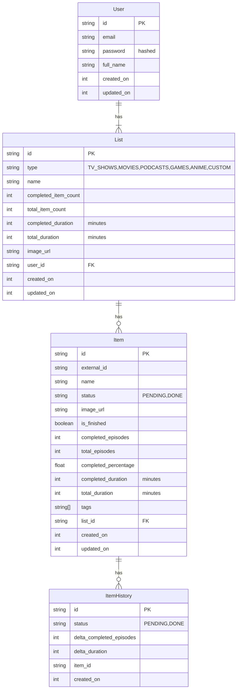

## DB Schema 

```mermaid
erDiagram
    User {
        string id "PK"
        string email
        string password "hashed"
        string full_name
        int created_on
        int updated_on
    }

    List {
        string id "PK"
        string type "TV_SHOWS,MOVIES,PODCASTS,GAMES,ANIME,CUSTOM"
        string name
        int completed_item_count
        int total_item_count
        int completed_duration "minutes"
        int total_duration "minutes"
        string image_url
        string user_id "FK"
        int created_on
        int updated_on
    }

    Item {
        string id "PK"
        string external_id
        string name
        string status "PENDING,DONE"
        string image_url
        boolean is_finished
        int completed_episodes
        int total_episodes
        float completed_percentage
        int completed_duration "minutes"
        int total_duration "minutes"
        string[] tags
        string list_id "FK"
        int created_on
        int updated_on
    }

    ItemHistory {
        string id "PK"
        string status "PENDING,DONE"
        int delta_completed_episodes
        int delta_duration
        string item_id
        int created_on
    }

    User ||--|{ List : has
    List ||--o{ Item : has
    Item ||--o{ ItemHistory : has
```