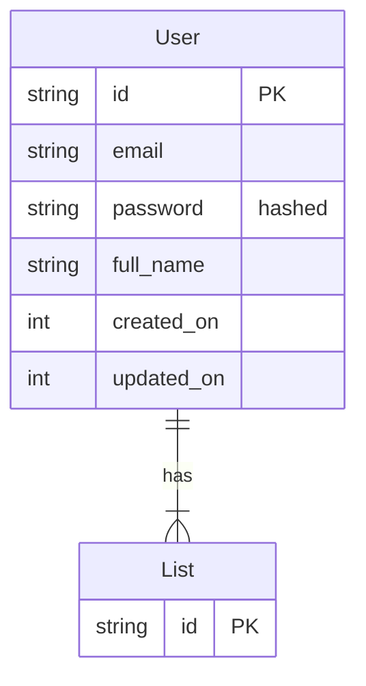

## User Journey for Adding an Item to the List

## Sample ER Diagram 

```mermaid
erDiagram
    User {
        string id "PK"
        string email
        string password "hashed"
        string full_name
        int created_on
        int updated_on
    }

    List {
        string id "PK"
        
    }

    User ||--|{ List : has
```